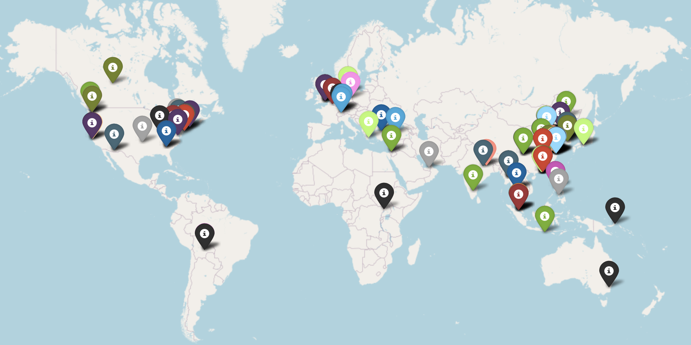

## About Me

I'm a full-time PhD student at [HKUST Guangzhou](https://www.hkust-gz.edu.cn/), and I'm also an affiliate researcher at the [IDEA Research](https://www.idea.edu.cn/), working on Large Language Models.
<!-- I am engaged in pre-trained large language model work, including LLM, Multimodal LLM, and Diffusion-based AIGC model.  -->
I am one of the earliest developers in China to conduct research on [Pretrain Models](https://huggingface.co/IDEA-CCNL), [Vision-Language Model](https://arxiv.org/abs/2310.08166), and [Diffusion-based AIGC model](https://huggingface.co/IDEA-CCNL/Taiyi-Stable-Diffusion-1B-Chinese-v0.1).
Internship and work experience include internet companies, state-owned enterprises, and research institutes. 
Rich in technical passion and curiosity, enjoys sharing and exploring Data and Knowledge, Multimodal, Generative AI, and General Artificial Intelligence.

## Experiences

### Education
- **[2024.09 - Now]** Joint PHD program of [HKUST(GZ)](https://www.hkust-gz.edu.cn/) and [IDEA Research](https://www.idea.edu.cn/), co-supervised by [Prof.Jia LI](https://sites.google.com/view/lijia) and [Prof.Jian GUO](https://www.idea.edu.cn/person/guojian/)
- **[2018.09 - 2020.07]** Master's in Information Science, supervised by [Prof.Jimin Wang](http://www.im.pku.edu.cn/szll/xxxwyjs/wjm/index.htm), [SCIE Lab](https://scie.pku.edu.cn/), Peking University
- **[2014.09 - 2018.07]** Bachelor's in Information Management and Information Systems, Xidian University

### Intern and Work
- **[2021.07 - Now]** Algorithm Engineer & LLM Researcher, [IDEA](https://www.idea.edu.cn/), Shenzhen
- **[2020.07 - 2021.07]** Algorithm Engineer, [The Smart City Research Institute of CETC](https://cetccity.cetc.com.cn/), Shenzhen
- **[2019.07 - 2020.05]** Big Data Development Intern, [ByteDance](https://www.bytedance.com), Beijing
- **[2018.07 - 2018.10]** Data Analysis Intern, [Chinese Academy of Science and Technology for Development](http://www.casted.org.cn/), Ministry of Science and Technology (MOST), Beijing

## Research Interests

<!-- - **FinAI:** FinLLM, Quant Trading -->
- **Agent:** Multi-Agent, Agent Evolution, Memory and Knowledge, Tool use, Reinforcement Learning
- **Multi-modal:** Multi-modal LLM, Diffusion model
- **NLP:** LLM, Natural Language Understanding, Information Retrival, Natural Language Generation

<!-- ## News

- **[Feb. 2020]** Our paper about incremental learning is accepted to CVPR 2020.
- **[Feb. 2020]** We will host the ACM Multimedia Asia 2020 conference in Singapore!
- **[Sept. 2019]** Our paper about few-shot learning is accepted to NeurIPS 2019.
- **[Mar. 2019]** Our paper about few-shot learning is accepted to CVPR 2019. -->



## Citation Map

<!--  -->
